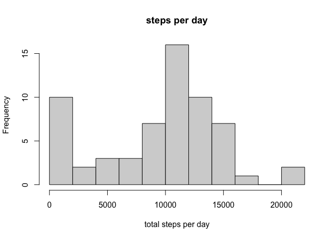
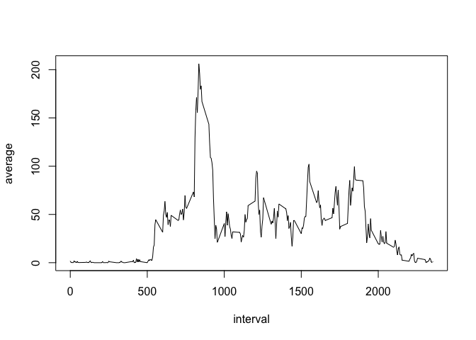
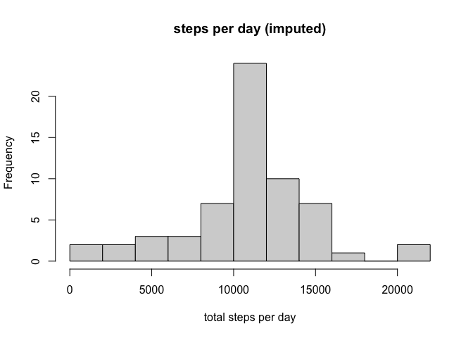
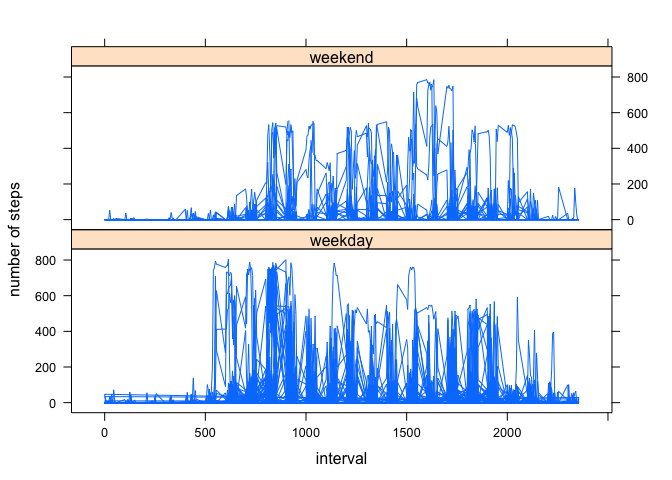

```r
library(tidyverse)
```

```
## ── Attaching packages ─────────────────────────────────────── tidyverse 1.3.1 ──
```

```
## ✓ ggplot2 3.3.3     ✓ purrr   0.3.4
## ✓ tibble  3.1.0     ✓ dplyr   1.0.5
## ✓ tidyr   1.1.3     ✓ stringr 1.4.0
## ✓ readr   1.4.0     ✓ forcats 0.5.1
```

```
## ── Conflicts ────────────────────────────────────────── tidyverse_conflicts() ──
## x dplyr::filter() masks stats::filter()
## x dplyr::lag()    masks stats::lag()
```

```r
library(lattice)
```

### Loading and preprocessing the data
Here, the total steps each day is calculated.
Then, the average number of steps at each time of day is calculated.

```r
activity <- read.csv("activity.csv")
activity_by_day <- group_by(activity,date)
summary_by_day<-summarize(activity_by_day,total = sum(steps,na.rm=TRUE))
activity_by_time <- group_by(activity,interval)
summary_by_time <- summarize(activity_by_time,average=mean(steps,na.rm=TRUE))
```

### What is mean total number of steps taken per day?
Here is a histogram of the number of steps taken per day:

```r
hist(summary_by_day$total,breaks=10, xlab="total steps per day", main="steps per day")
```

<!-- -->
The mean and median of the total steps per day are shown in the following summary:

```r
summary(summary_by_day)
```

```
##      date               total      
##  Length:61          Min.   :    0  
##  Class :character   1st Qu.: 6778  
##  Mode  :character   Median :10395  
##                     Mean   : 9354  
##                     3rd Qu.:12811  
##                     Max.   :21194
```

### What is the average daily activity pattern?

```r
plot(summary_by_time,type="l")
```

<!-- -->
The time of day with the highest average number of steps is determined thus:

```r
head(arrange(summary_by_time,desc(average)))
```

```
## # A tibble: 6 x 2
##   interval average
##      <int>   <dbl>
## 1      835    206.
## 2      840    196.
## 3      850    183.
## 4      845    180.
## 5      830    177.
## 6      820    171.
```
It is seen to be the 835th time interval.

### Imputing missing values

```r
number_of_missing_values <- sum(as.numeric(is.na(activity$steps)))
```
There are 2304 missing values in the dataset.
The following strategy is used to impute these missing values: for each missing value, the mean number of steps for that time interval (averaged across all days) is imputed.

```r
activity_by_time_full <- full_join(activity,summary_by_time)
```

```
## Joining, by = "interval"
```

```r
activity_imputed <- mutate(activity_by_time_full,imputed=ifelse(is.na(steps),average,steps))
```
Now the data is re-examined with the imputed values:

```r
activity_imputed_by_day <- group_by(activity_imputed,date)
summary_imputed_by_day<-summarize(activity_imputed_by_day,total = sum(imputed,na.rm=TRUE))
```
Here is a histogram of the number of steps taken per day:

```r
hist(summary_imputed_by_day$total,breaks=10, xlab="total steps per day", main="steps per day (imputed)")
```

<!-- -->


The old histogram had the leftmost bar (the one containing the days with the most missing values) quite high. The new histogram has the leftmost bar more consistent with the pattern of the rest of the data; that bar is now the same height as the one to its right.
The mean and median of the total steps per day are shown in the following summary:

```r
summary(summary_imputed_by_day)
```

```
##      date               total      
##  Length:61          Min.   :   41  
##  Class :character   1st Qu.: 9819  
##  Mode  :character   Median :10766  
##                     Mean   :10766  
##                     3rd Qu.:12811  
##                     Max.   :21194
```

### Are there differences in activity patterns between weekdays and weekends?

```r
activity_imputed <- mutate(activity_imputed,weekpart=ifelse(weekdays(as.Date(date)) %in% c("Saturday","Sunday"),"weekend","weekday"))
xyplot(steps ~ interval|weekpart, 
           data = activity_imputed,
           type = "l",
           xlab = "interval",
           ylab = "number of steps",
           layout=c(1,2))
```

<!-- -->

It can be seen by comparing the two panels of the plot that activity on the weekends tends to start later in the day and continue until later in the day, than it does on weekdeays.
